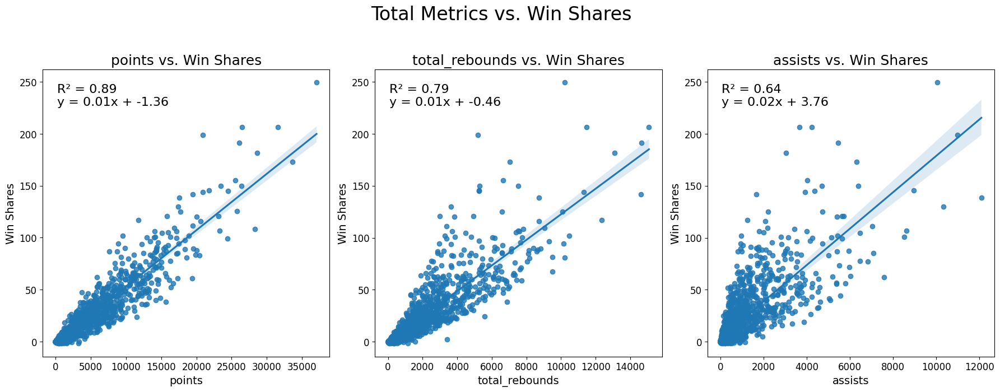

# Exploring NBA Draft Picks (1989-2021): A Comprehensive Analysis

## Introduction

My project delves into the NBA Draft picks spanning from 1989 to 2021, aiming to address specific research questions that shed light on the performance and impact of players based on their draft positions. As both a fan of the NBA and a data science major, the project was particularly interesting; in a sense, I was providing similar analysis that front offices/scouting departments produce to prepare for drafting new players each year. The primary research questions include: 
1) How do first overall picks compare in performance metrics to other picks?
2) How do performance metrics differ by decade?
3) What colleges send the most players to the NBA and how do they influence a player's draft position?
4) What are the major contributors to a player's win shares?
5) Can a basic predictive model be established for a player's win shares based on their overall pick?

## Selection of Data
### Information

The dataset comprises comprehensive information on NBA Draft picks from 1989 to 2021, encompassing details such as the year, overall pick, and player-specific data. The source of the dataset is from basketball reference – one of the most reputable and comprehensive sources of NBA data. Furthermore, the specific data set was found on Kaggle and has a useability rating of 10.00 – confirming completeness, credibility, and compatibility. In terms of characteristics, the data set includes information about performance metrics, college affiliations, and draft pick details.

### Data Cleaning 

In terms of any munging, imputation, or feature engineering, there was specific cleaning necessary to work with the data. Firstly, I had to handle null/missing data: for the numerical values, I changed all missing data to 0 (as the player never played in the NBA), and for the object values I simply dropped all missing data (as any player who did not go to college or did not play on a team would inherently provide no use to the data analysis). Furthermore, I added a data column for decade (based on when a player was drafted), and filtered data such as separating #1 overall picks from all other picks. 

## Methods

Materials and tools employed in this analysis include NumPy, Pandas, Matplotlib, Seaborn, and Scipy for exploratory data analysis, visualizations, and statistical testing.

1) For question 1, I used Seaborn to graph the performance metrics (points, assists, rebounds, etc.) as the y axis and years active as the x-axis, filtering data for the first overall picks vs. all other picks. I also used linregress from scipy.stats library to calculate and display the R2 value for each graph. I chose to incorporate a regression line because the performance metrics (points, assists, rebounds) appeared to have a linear relationship with the number of years active, providing insight in comparing first overall picks to other picks. However, with most applications of a linear regression model, the assumption of a linear relationship does limit the model’s accuracy as the data does not follow a precisely linear distribution. The linregress function calculates all the necessary components to create a linear regression line and an R2 simply by passing the two variables as parameters.
2) For question two, I used Matplotlib along with sns.lineplot to create 3 subplots for performance metrics vs. years active based on each decade. I chose a line plot to capture the 4 decades on each graph and the trends of each metric throughout the decade based on the mean of that metric for each year.
3) For question 3, I used Matplotlib and seaborn to create both a boxplot and a bar plot to identify and visualize the top 20 colleges based on their frequency (bar graph) and the impact of these schools on a players draft position (box plot). I chose a bar graph as I wanted to display counts for different categories (different colleges) and I chose a box plot to determine what overall pick players from each school are drafted at by comparing different quartiles for each school (focused on the median).
4) For question 4, I essentially used the same tools as question 1: I used Matplotlib and Seaborn to create a scatter plot with a regression line with the performance metrics as the independent variable and win shares as the dependent variable, and linregress from scipy.stats to calculate and display the R2 value for each graph. Again, I used a regression line because the performance metrics appeared to have a linear relationship with win shares, and thus a meaningful relationship in the context of the question.
5) Lastly, for question 5, I used a simple LinearRegression training (based on a presumed linear relationship between independent variable overall pick and dependent variable win shares) from the Scikit-Learn library, model.fit and model.predict to make predictions based on the parameters X = overall pick and Y = win shares, and calculated a coefficient for the predicted win shares based on the overall pick. Because machine learning is a relatively new concept, I used resources online to help determine the structure of a basic predictive model for 2 variables.

## Results
### Question 1: How do first overall picks compare in performance metrics to other picks? 

RESULTS: As seen in the graphs above, for both the first overall and non-first overall picks, there is a relatively strong linear correlation for both points and rebounds vs. years active, and a weaker relationship for assists. Essentially, as a player plays more years in the league, there performance metrics also increase at a rather linear rate – which is a bit surprising as you may expect player development to induce a growing slope. However, an important note when comparing these graphs is the difference in the regression line equation for the first overall vs. non-first overall picks: (ignoring the y-intercept as this is rather trivial in context), the slope for each performance metric of the first overall picks is higher than the non-first overall picks. In context, this predictive line indicates that first overall picks produce higher performance metrics (score more points, get more assists and rebounds) than other picks on average.

### Question 2: How do performance metrics differ by decade?

RESULTS: As seen in the graphs above, there are apparent differences between performance metrics based on different decades in the NBA. For both the 1990s and 2000s, the line graph of the performance metrics almost overlap (with some peaks and lows), indicating players in these decades scored, rebounded, and assisted at similar rates. As a note, once the years active went beyond 15+ years, the performance metrics became a bit skewed, which makes sense because players who play this long are often times above average (since they are able to last that long in the NBA). However, looking at both the 2010 and 2020 lines, there seems to be an increase in performance amongst all metrics. Although this data is incomplete in the sense that the players drafted in these decades have not finished their careers, the findings indicate that players are scoring, rebounding, and assisting more on average than players in other decades. This makes sense, as performance training and recovery has only increased throughout time, so players are more skilled than previous decades.

### Question 3: What colleges send the most players to the NBA and how do they influence a player's draft position?

RESULTS: As seen in the graphs above and to the right, there are certain schools that dominate the pipeline to the NBA. Schools like Kentucky, Duke, Arizona, UNC, UCLA, and Kansas make up 45% of players sent to the NBA. However, the quantity of players sent to the NBA does not always correlate to the quality. For example, a school like Duke has a median pick position of around 15, while UCLA is above 30. Furthermore, a school like UNC has the middle 50% of its players being selected between pick 10 and 30, while a school like Michigan State has its middle 50% of its players being selected between picks 10 and 50. Thus, colleges definitely influence a players path to the NBA, in that big schools garner more attention from scouts (and have a more distinguished history), however, the box plot indicates that good players will be chosen at higher positions more independently than the school they attend. As a note, it is important to understand that these schools recruit the top talent around the world, thus, the schools influence is hard to distinguish from a player’s inherent capabilities.

### Question 4: What are the major contributors to a player's win shares? 

RESULTS: As seen in the graphs above, the biggest contributor to a player’s win shares is total performance metrics, followed by average performance metric, and lastly field goal and box plus/minus. Looking at the total performance metric graphs, the regression lines fit the scatter distribution relatively strongly – specifically the total points vs. win shares which has an R2 value of .89. Comparing this to the average statistics, the regression line does not fit the distribution as strongly, with points per game having an R2 value of .51. While this may not immediately make sense, average statistics are more prone to being skewed by outlier seasons, whereas the total metrics more accurately define how consistent a player is able to tally points, assists, and rebounds throughout their whole career. Furthermore, looking at field goal percentage and box plus/minus, the regression line has a very weak fit of the distribution. This makes sense because field goal percentage does not necessarily consider the number of shots or points scored as a result of the shots (and thus the value of such shots) and box plus/minus does not just look at an individual’s performance, but also the entire team. 

## Question 5: Can a basic predictive model be established for a player's win shares based on their overall pick?

RESULTS: The code output above represents a predictive model for a player’s win shares based on the pick they were chosen at. The coefficient of -0.675 means that on average, for each pick that a player drops (picked second instead of first, third instead of second, etc.), their win shares will decrease by 0.675 win shares on average. It is important to note that the Mean Squared Error is 575.29 indicates an extremely high amount of variance in this model. This means that it is difficult to accurately predict a player’s win shares simply based on the pick they were chosen with.

